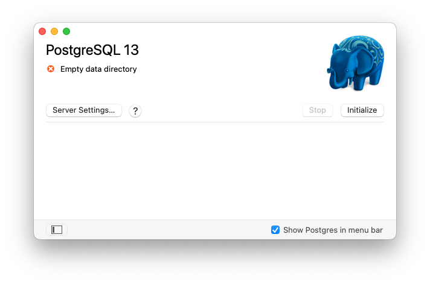

# "Data Management for Social Scientists" | Installation Instructions for Mac

## Installing R and RStudio

For Mac, the R project provides specific installers that are available at [https://cloud.r-project.org/](https://cloud.r-project.org/). Download the latest installer for your system, execute it by double-clicking on the file, and follow the installation instructions. 

To install RStudio, go to the RStudio website at \url{https://www.rstudio.com/products/rstudio/download/}. There are different versions, the "free" version is sufficient for our purpose. Download the installer, run this file and follow the installation instructions. You should now have R and RStudio installed on your computer. 

## Installing PostgreSQL and the PostGIS extension

To run the PostgreSQL database server on a Mac, we rely on the excellent *Postgres.app* installer. This is a pre-packaged version the (open-source) PostgreSQL database system and extremely convenient for Mac users to install. 

Download the installer from the [Postgres.app website](https://postgresapp.com/downloads.html). We recommend that you choose version 2.4.1 of Postgres.app, which includes version 13 of the PostgreSQL database server. Conveniently for our purpose, Postgres.app contains also the PostGIS spatial extension for PostgreSQL, which we need in the chapter on spatial data. Run the installer by double-clicking the file you downloaded and simply drag-and-drop Postgres.app into your "Applications" folder.

Once this is done, you can run Postgres.app just like any other Mac application, simply by double-clicking on it in the "Applications" folder. The first time you do this you need to initialize a new server, as this is not done automatically. When you start Postgres.app, the following window comes up:

At the bottom left, click the little `+` icon to add a server. Enter a name for the new server, for example "Postgres 13". Select version 13, and leave the default values for the data directory and the port (5432) unchanged. Click "Create Server", and you're done. The new server is not running yet, so you need to start it with the corresponding button in Postgres.app. You can now close the Postgres.app main window. The elephant icon in the main menu bar allows you to quickly start/stop your server.

When we later connect to our new server from R, we need to provide a user name and a password. Postgres.app automatically configures the server such that is uses your (short) Mac username for this purpose. If you're unsure what this username is, see [Apple's instructions](https://support.apple.com/en-ae/guide/mac-help/mh35548/11.0/mac/11.0) to find out. By default, there is no password for this user. 

You now have running PostgreSQL server on your system. For the exercises in the book, it is important that you remember the name of the user:

* Username: `<your_MacOS_username>`
* Password: `''` (or anything else, since it's not checked)

Whenever we connect to the database server in the chapters of the book, username and password must be set correctly, otherwise the connection will fail. In our examples, we assume that you left the default port (`5432`) unchanged, and that you installed PostgreSQL on your local machine (which is referred to as `localhost`). If this is *not* the case and for some reason you deviate from this standard configuration, you will have to adjust these parameters for the DB connections in the code examples.

Please note: We are installing the PostgreSQL server here with a minimal configuration and solely for the purpose of running the exercises in the book. If you plan to use the server together with other users, such that it can be reached also from other machines, some more configuration is required to enable this and to properly secure the server. The configuration presented here is *not* intended for this purpose. 

## Uninstalling PostgreSQL

Instructions for removing Postgres.app from your system are provided [here](https://postgresapp.com/documentation/install.html). 
