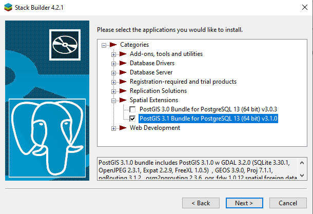

# "Data Management for Social Scientists" | Installation Instructions for Windows

## Installing R and RStudio

For Windows, the R project provides specific installers that are available at [https://cloud.r-project.org/](https://cloud.r-project.org/). Download the latest installer for your system, execute it by double-clicking on the file, and follow the installation instructions. 

To install RStudio, go to the RStudio website at \url{https://www.rstudio.com/products/rstudio/download/}. There are different versions, the "free" version is sufficient for our purpose. Download the installer, run this file and follow the installation instructions. You should now have R and RStudio installed on your computer. 

## Installing PostgreSQL and the PostGIS extension

To run the PostgreSQL database server under Windows, we rely on the version provided by EnterpriseDB. This is a company that specializes in the commercial development and distribution of the (open-source) PostgreSQL database system. EnterpriseDB also offers a freely available, unsupported version of PostgreSQL, which is convenient for Windows users to install. 

Download the installer from the [EnterpriseDB website](https://www.enterprisedb.com/downloads/postgres-postgresql-downloads). We recommend that you choose the most recent update of version 13 (13.x). In the unlikely event that you are still using a 32-bit machine, just use the last version available for 32-bit (10.x). Run the installer by double-clicking the file you downloaded.

During the installation, just accept the default options provided. You should install *all components*. The installer also asks you to set a password for the superuser (which is the administrator account for the database server and is called *postgres*). Make sure to remember this password! Leave the port number (5432) unchanged. 

To enable some extended modules for processing spatial data, we also need to install the PostGIS extension for PostgreSQL. At the end of the PostgreSQL installation, the installer asks you whether StackBuilder (an extension manager) should be started. Click "Yes". Next, you see window where you need to choose the server you want to modify. Select the server you just installed from the dropdown list (it is likely the only one on the list). See the following screenshot for PostgreSQL Version 13:

Continue with the installation, and StackBuilder will display a list of modules it can install for PostgreSQL. In this dialogue box, open "Spatial Extensions" and select the PostGIS bundle (we recommend Version 3.1, but earlier versions such as 3.0 will also work). Here is a screenshot:

Click "Next" and accept the default settings, until the installation is complete. 

You now have running PostgreSQL server on your system. For the exercises in the book, it is important that you remember the name of the user, as well as the password you chose during the installation (see above):

* Username: `postgres`
* Password: `<your_postgres_password>`

Whenever we connect to the database server in the chapters of the book, username and password must be set correctly, otherwise the connection will fail. In our examples, we assume that you left the default port (`5432`) unchanged, and that you installed PostgreSQL on your local machine (which is referred to as `localhost`). If this is *not* the case and for some reason you deviate from this standard configuration, you will have to adjust these parameters for the DB connections in the code examples.

## Uninstalling PostgreSQL

You can remove the EnterpriseDB Postgres/PostGIS installation via the Control Panel - Programs - Uninstall a program. Remove both PostgreSQL and the PostGIS Bundle. 

